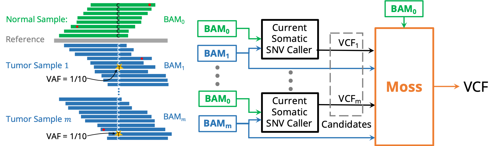

# Moss

[](https://anaconda.org/bioconda/moss)
[](http://bioconda.github.io/recipes/moss/README.html)

Moss is a multi-sample somatic single nucleotide variant (SNV) calling tool aiming for discovering variants with a low variant allele frequency that repeatedly appears in several samples.
Moss works as an extension to existing single-sample somatic variant callers and improves the recall meanwhile maintains high precision.
Moss takes as input the BAM files of multiple samples and corresponding VCF output of the single-sample caller.



## Contents

  1. [Installation](#install)
      * [Using conda](#conda) (recommended)
      * [Build from source](#compilation) (alternative)
          * [Dependencies](#dep)
          * [Compilation](#comp)
      * [Docker image](#docker)
  2. [Usage instructions](#usage)
      * [Conda/compiled usage](#conda-usage)
      * [Docker usage](#docker-usage)

<a name="install"></a>

## Installation

<a name="conda"></a>

### Using conda (recommended)

1. Create a new conda environment named "moss" and install dependencies:

   ```bash
   conda create -n moss
   ```

2. Then activate the created environment: `conda activate moss`.
3. Install the package into current environment "moss":

    ```bash
    conda install -c bioconda moss
    ```

<a name="compilation"></a>

### Build from source (alternative)

<a name="dep"></a>

#### Dependencies

Moss is written in C++11 and thus requires a modern C++ compiler (GCC >= 4.8.1, or Clang). In addition, Moss has the following dependencies.

* [HTSlib](https://github.com/samtools/htslib/releases) (>= 1.7)
* [CMake](http://www.cmake.org) (>= 3.9)
* Python (>= 3.6)
* [Scikit-allel](https://pypi.org/project/scikit-allel/)

<a name="comp"></a>
#### Compilation

```bash
mkdir build
cd build
cmake -DCMAKE_BUILD_TYPE=Release ..
```

If `HTSlib` is not in the system path, CMake may not be able to find it. Users then need to manually set the path for `htslib` using `ccmake`:

```bash
ccmake ..
```

Then finally make Moss.

```bash
make
```

The compilation results in the executable `moss`.

<a name="docker"></a>
### Docker image

The docker image is available on [Docker Hub](https://hub.docker.com/r/chuanyiz/moss), which can be pulled from Docker Hub by the following command `docker pull chuanyiz/moss`.

<a name="usage"></a>
## Usage instructions

Moss works on top of other somatic variant calling methods, such as Strelka2 and Mutect2.
We assume you have already run the base variant caller as their manual suggested and get the VCF files of each sample.

<a name="conda-usage"></a>
### Conda/compiled usage

Firstly run the python script `scripts/union_candidates.py` to generate a VCF file of candidates loci as an input to Moss. For example you can run the toy example in `data/`:

```bash
cd data
python ../scripts/union_candidates.py -f samples.list --normal-name sample0 -t strelka -o candidates.vcf
```

To run Moss, you need a reference genome FASTA file, BAM files for normal and tumor samples, realigned BAM files (optional but recommended), and a candidate loci VCF.
For example, after you've built `moss` in the `build/` directory, you can continue the toy example in `data/`:

``` bash
cd build
./moss -r ../data/demo20.fa -b ../data/normal.sort.bam -R ../data/empty.bam -b ../data/sample0.spike.sort.bam -R ../data/empty.bam -b ../data/sample1.spike.sort.bam -R ../data/empty.bam -b ../data/sample2.spike.sort.bam -R ../data/empty.bam -b ../data/sample3.spike.sort.bam -R ../data/empty.bam -l ../data/candidates.vcf -m 4 -t -0.693 --ignore0 --grid-size 200 -o example.vcf
```

Finally, we filter the result VCF file:

``` bash
bgzip example.vcf
tabix example.vcf.gz
python ../scripts/post_filter.py --normal-name sample0 -i example.vcf.gz -o example.post_filter.vcf
```
<a name="docker-usage"></a>
### Docker usage

Organize your data in the same structure as the `data/` folder.
Modify the `config.yaml` following the instructions within the file, and it will be used to generate the commands for Moss within the container.
When sterting the docker container, you need to bind-mount the data folder by argument `-v path:/moss_data:`, where `path` represents the _absolute_ path to your data folder in the host, and `/moss_data` is the mounted location in the container.

```bash
docker run -it -v path:/moss_data: chuanyiz/moss /bin/bash -c "python /moss_scripts/run_moss.py -c /moss_data/config.yaml -o /moss_data/run_moss.sh && bash /moss_data/run_moss.sh"
```
